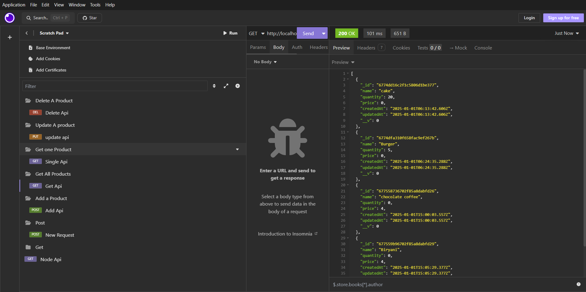

# 

## 🚀 Simple CRUD App Backend

This project is a **Simple CRUD (Create, Read, Update, Delete)** API built using **Node.js**, **Express**, and **MongoDB**. It provides a basic understanding of how to build a RESTful API with a database connection and implement common database operations.

## ✨ Technologies Used

[](https://nodejs.org/)
[](https://expressjs.com/)
[](https://www.mongodb.com/)
[](https://mongoosejs.com/)
[](https://nodemon.io/)

## ✨ Features

- **Product Management**: The app allows managing products by performing CRUD operations.
- **Endpoints**:
  - `GET /api/products`: Fetches all products.
  - `GET /api/products/:id`: Fetches a single product by its ID.
  - `POST /api/products`: Creates a new product.
  - `PUT /api/products/:id`: Updates a product's details.
  - `DELETE /api/products/:id`: Deletes a product by its ID.

## 📚 What I Learned

### 1. **Creating a Node.js Server**
   - Learned how to set up a basic **Node.js** server using **Express.js** to handle incoming HTTP requests.

### 2. **CRUD Operations**
   - Implemented basic **CRUD** operations for managing products:
     - **Create** a product via the `POST` method.
     - **Read** products with `GET` requests.
     - **Update** product details using the `PUT` method.
     - **Delete** a product via the `DELETE` method.

### 3. **MongoDB Integration**
   - Learned how to integrate **MongoDB** into a Node.js application using **Mongoose** for defining the data schema and handling data operations.
   - Used **MongoDB Atlas** to host a cloud database.

### 4. **Error Handling**
   - Implemented error handling for common issues such as invalid data and database connection failures.

### 5. **Environment Configuration**
   - Managed environment variables to securely store sensitive information like the **MongoDB connection URL**.

### 6. **Data Validation**
   - Applied basic validation using Mongoose to ensure proper data formats and constraints are met (e.g., product name, price, and quantity).

### 7. **Server Restarting with Nodemon**
   - Used **Nodemon** to automatically restart the server whenever file changes occur, improving the development workflow.

## 🔧 How to Run the Project

### Prerequisites

- **Node.js**: Ensure that Node.js is installed on your machine.
- **MongoDB Atlas**: Create a free MongoDB Atlas cluster for a cloud-based database.

### Setup

1. Clone the repository:
   ```bash
   git clone https://github.com/Hari-hara7/Simple-crud-app-backend.git
   cd simple-crud-app-backend
